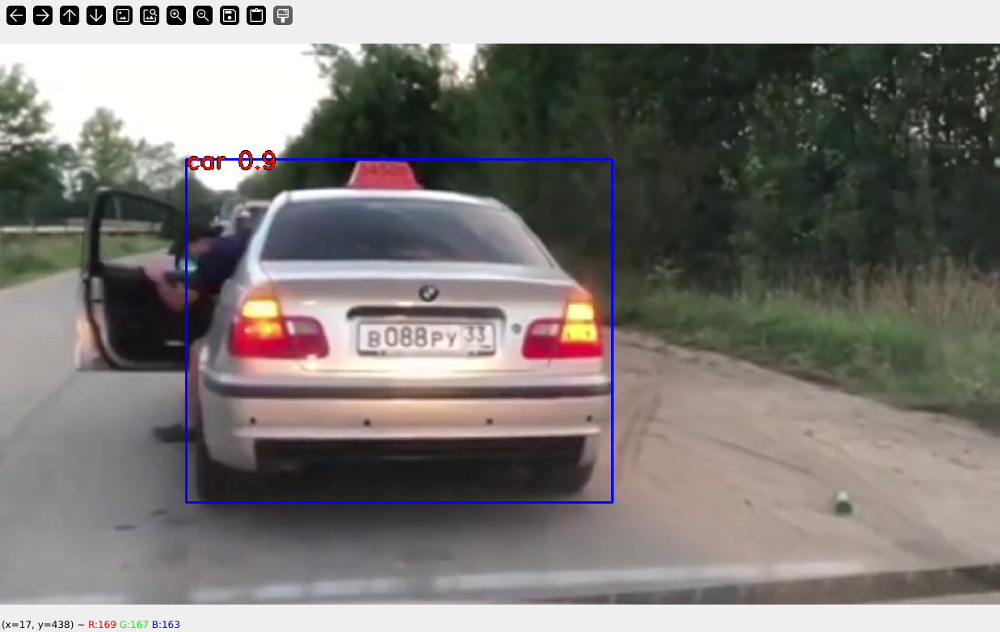

# Trash App v0

object-detection playground to explore practical uses of modern object detection.

# Testing

```bash
python trash_app.py test-data/youtube_0PdJv2fAGeo.mp4
```

# Research

 - https://docs.ultralytics.com/tasks/detect/#models
 - https://pyimagesearch.com/2020/09/21/opencv-automatic-license-number-plate-recognition-anpr-with-python/
 - https://github.com/roflcoopter/viseron

# Status




